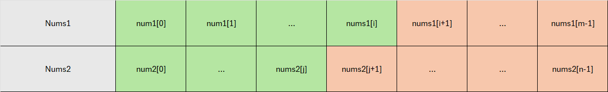
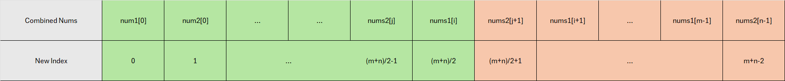

# Question:
假設有兩個已經排序的陣列 $nums1$ 和 $nums2$，我們希望找到這兩個陣列合併後的中位數。直觀上可以將兩個陣列合併後再計算中位數，但這樣的時間複雜度為 $O(m+n)$。為了提升效率，我們希望透過二分搜尋法達到 $O(\log(\min(m, n)))$ 的時間複雜度。


# 核心概念
假設中位數位於 $nums_1$ 的索引為 $i$，則 $nums_1$ 提供了 $i$ 個小於等於中位數的元素(綠色)，且$nums_2$ 提供了 $j$ 個小於等於中位數的元素(綠色)，如下圖。



我們可以合併$nums_1$和$nums_2$為$combined$ $nums$，並根據$median$左側的元素數量(綠色)必相等於右側的元素數量(橘色)這個條件推導出$i$和$j$之間關係


**Note:** 綠色部分為小等於$median$元素；橘色部分為大於$median$元素\
\
若 $nums_1$ 提供了 $i$ 個小於等於中位數的元素(綠色)，這意味著 $nums_2$ 需要提供 $\frac{m+n}{2} - i$ 個小於等於中位數的元素，因此
$$j = \frac{m+n}{2} - i \mbox{———}(1)$$

\
\
此外，由於所有在橘色中的元素必大於在綠色中的元素，且$nums_1[i]$ 是$median$，所以必須滿足以下條件：
$nums_1$ 中：$$ nums_2[j] \leq nums_1[i] < \min(nums_1[i+1], nums_2[j+1]) \mbox{———}(2)$$
\
然而$median$並非一定在$nums1$，所以我們可以反推$median$在$nums2$，使得滿足以下的式子2，中位數位於 $nums_3$
$$ nums_1[i] \leq nums_2[j] < \min(nums_1[i+1], nums_2[j+1]) \mbox{———}(3)$$


合併以上2、3式，我們可得知中位數為 $\max(nums_1[i], nums_2[j])$。

# 二分搜尋法
接下來我們可以利用二分搜尋法來找出索引 $i$，並推導出對應的索引 $j$，然而我們可能會遇到以下4種狀況
可能發生的狀況：

**情況**
- 情況 1. $nums1[i] > nums1[i+1]$：這種情況不可能發生，因為 $nums1$ 已經是排序過的。
- 情況 2. $nums2[j] > nums2[j+1]$：這種情況不可能發生，因為 $nums2$ 已經是排序過的。
- 情況 3. $nums1[i] > nums2[j+1]$：這表示 $nums1$ 中左側的元素數量（綠色部分）超過了應有的數量，因此我們需要將 $i$ 向左移動，減少 $nums1$ 對綠色部分的貢獻。
- 情況 4. $nums2[j] > nums1[i+1]$：這表示 $nums1$ 對橘色部分的貢獻過多，因此我們需要將 $i$ 向右移動，增加 $nums1$ 對綠色部分的貢獻。

# Implement


```python
class Solution {
public:
    double findMedianSortedArrays(vector<int>& nums1, vector<int>& nums2) 
    {
        //Search the shorttest nums
        if(nums1.size() > nums2.size()) return findMedianSortedArrays(nums2, nums1);
        int Start = 0;
        int End = nums1.size();
        int Len1 = nums1.size();
        int Len2 = nums2.size();
        int Len = Len1 + Len2;

        //Binary Search
        while(Start<=End)
        {
            //M1 is the index i+1 in the note
            int M1 = Start + (End-Start)/2;

            //M2 is the index j+1 in the note
            int M2 = (Len+1)/2 - M1;

            //Boundary Condition
            //if i/j <= 0 then i/j = INT_MIN
            int L1 = (M1==0)?INT_MIN:nums1[M1-1];
            int L2 = (M2==0)?INT_MIN:nums2[M2-1];
            //if i/j >= Len1/2 then i/j = INT_MAX
            int R1 = (M1==Len1)?INT_MAX:nums1[M1];
            int R2 = (M2==Len2)?INT_MAX:nums2[M2];

            if(L1>R2)
            {
                //Move to Left
                End = M1 - 1;
            }
            else if(L2>R1)
            {
                //Move to Right
                Start = M1 + 1;
            }
            else
            {
                //Get the median
                //Even
                if((Len%2) == 0) return ((max(L1,L2)+min(R1,R2))/2.0);
                //Odd
                else return max(L1,L2);
            }
        }
        //Never Reach Here
        return 0;
    }
};
```

# Result


# REFERENCE
山景城一姐 (2019). [LeetCode]4. Median of Two Sorted Arrays 中文. *Youtube.* Available at: https://www.youtube.com/watch?v=ScCg9v921ns (Accessed: 11th Nov, 2024)


```python

```
